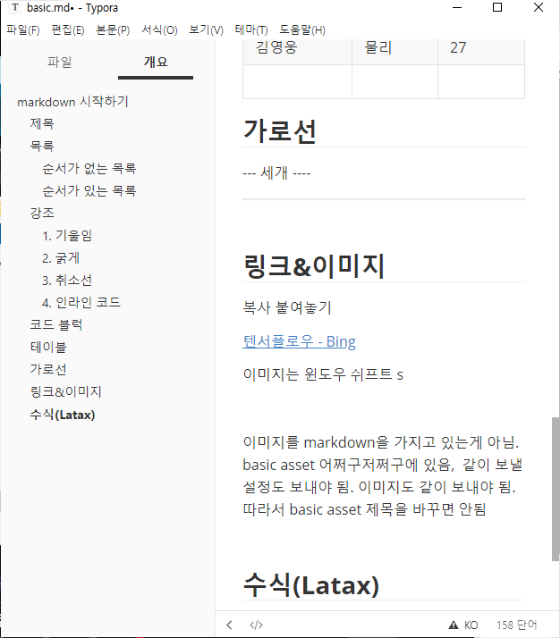

# markdown 시작하기

## 제목

가장 큰 제목부터 6번째로 큰 제목 존재

#의 개수로 중요도 설정

## 목록
순서가 있는 목록과 순서가 없는 목록이 존재

### 순서가 없는 목록
-와 *을 앞에 붙이고 사용

- 1,2,3
- 2,3,4
### 순서가 있는 목록
1을 뛰우고 사용

1. 123
2. 234

## 강조

글자의 스타일 지정하기


### 1. 기울임 

*로 감싸세요.

   *기울임*

### 2. 굵게

**로 감싸세요.

   **굵어짐**

### 3. 취소선

~~로 감싸세요.

   ~~취소선~~

### 4. 인라인 코드 

``으로 감싸세요.

   `pwd` `ls`

## 코드 블럭

백틱 세개로 감싼 출력은 코드 블럭입니다

```python
def my_hello()
	print("hello!")
```


## 테이블 

| 이름   | 전공 | 나이 |
| ------ | ---- | ---- |
| 김싸피 | 전공 | 25   |
| 김영웅 | 물리 | 27   |
|        |      |      |

## 가로선

--- 세개 ----

--- ----


## 링크&이미지

복사 붙여놓기

[텐서플로우 - Bing](https://www.bing.com/search?q=텐서플로우&cvid=be7ca78bfc5847918229301475ef57d3&aqs=edge..69i57j0l8.1760j0j4&FORM=ANAB01&PC=U531)

이미지는 윈도우 쉬프트 s




이미지를 markdown을 가지고 있는게 아님. basic asset 어쩌구저쩌구에 있음,  같이 보낼 설정도 보내야 됨. 이미지도 같이 보내야 됨.따라서 basic asset 제목을 바꾸면 안됨


## 수식(Latax)

원래 마크다운은 지원하지 않지만, 타이포라가 지원해줌. 

> =latax typora  math block 참조

이는 노션에도 싹다 적용가능
